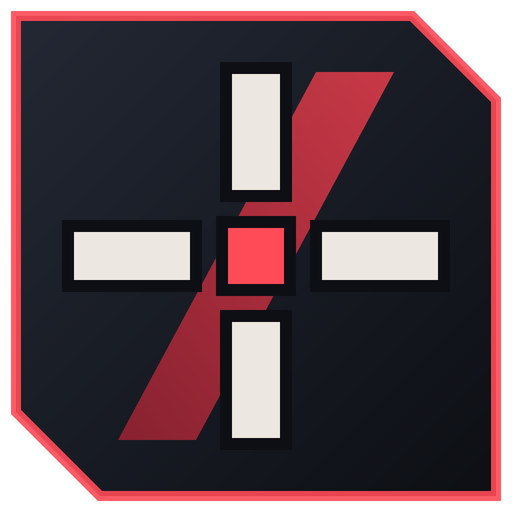

<p align="center"></p>

# Valtrainer: an aim trainer calibrated for Valorant

Valtrainer is a native Windows aim trainer written in C++17 with raylib. It reads your
mouse through the **Windows Raw Input API**, so your aim feels exactly like in
Valorant:

- **1:1 with Valorant:** every mouse count turns `sens × 0.07°`, with a 103° horizontal FOV (Hor+).
  There is no smoothing and no acceleration, and Windows "Enhance pointer precision" is bypassed.
- **Every raw packet counts:** all mouse packets between frames are applied in order,
  so nothing is lost at 1000–8000 Hz polling. Each click is judged at the exact
  crosshair position where it happened, even in the middle of a frame.
- **Timing:** FPS is uncapped by default with V-Sync off. You can set an optional cap (144/240/360, or any custom value from 30 to 2000),
  and an FPS counter shows frame time. All timing uses `QueryPerformanceCounter`.
- **Eight training modes:** Gridshot, Microshot, Tracking (ADAD strafes), Flick 180, Reaction, Peek Practice,
  Crosshair Placement and Sniper, each with Easy / Normal / Hard / Insane difficulty. Sniper is an
  angle-holding scenario (Marshal / Outlaw / Operator) where enemies swing, jump, crouch and jiggle peek and you move and
  shoot like in Valorant. The **scoped sensitivity multiplier** works like Valorant's.
- **VS Bot:** a 1v1 Sheriff duel on a skirmish-style map against a bot from Iron to Radiant. You move
  like in Valorant: run, walk, crouch, jump and counter-strafe, with movement inaccuracy, visible
  recoil and a first-person pistol.
- **Sens Finder:** uses the Perfect Sensitivity Approximation (PSA) method. It runs 7 rounds of blind A/B
  tests, draws a graph of your results, and has a one-click "apply" button. Every session
  is saved and combined into an average across days.
- **Stats:** after each run you get score, accuracy, reaction time, time-to-kill (TTK), and your
  overshoot/undershoot tendency, plus a coaching tip (e.g. *"You overshoot flicks, try
  lowering sens ~5%"*). Per-mode progress graphs and personal bests are included.
- **Crosshair editor:** Valorant-style, with a live preview. You can **paste your Valorant crosshair share code** to import it,
  including firing / movement error, separate vertical lengths and fading. You can
  also change target colour, map brightness, volume and keybinds.

No Riot logos, fonts or assets are used. The UI uses the Windows system font
(Bahnschrift or Segoe UI), and every sound is generated in code.

---

## Just want to play? Download it

Open the repository's **Releases** page (right-hand side on GitHub), download
**`Valtrainer-windows-x64.zip`**, extract it and double-click `Valtrainer.exe`. No
install is needed. Every release is built automatically by GitHub Actions with
Visual Studio (MSVC), with warnings treated as errors and the math self-test run.

To build it yourself instead, follow the steps below.

---

## Build it (step by step)

You only need two free tools: **Visual Studio 2022 Build Tools** (the C++
compiler) and **CMake** (the build system). raylib is downloaded automatically.

### 1. Install Visual Studio 2022 Build Tools (the C++ compiler)

1. Go to <https://visualstudio.microsoft.com/downloads/>.
2. Scroll down to **"Tools for Visual Studio"** and download
   **"Build Tools for Visual Studio 2022"**.
3. Run the installer. On the **Workloads** tab, tick
   **"Desktop development with C++"**. Keep the default options on the right,
   which include "MSVC v143" and a "Windows 11 SDK" (or Windows 10 SDK).
4. Click **Install** and wait. It is a few GB, so it can take a while.

*(Alternative for experienced users: in PowerShell run
`winget install Microsoft.VisualStudio.2022.BuildTools --override "--add Microsoft.VisualStudio.Workload.VCTools --includeRecommended --passive"`.)*

### 2. Install CMake

1. Go to <https://cmake.org/download/>.
2. Download the **Windows x64 Installer** (`cmake-x.y.z-windows-x86_64.msi`).
3. Run it. When asked, choose **"Add CMake to the PATH for all users"**.

*(Alternative: `winget install Kitware.CMake`.)*

### 3. Get the code

- On the GitHub page click **Code → Download ZIP**, then extract it to a simple
  path such as `C:\Valtrainer`.
  *(Or, if you use git: `git clone <repo-url> C:\Valtrainer`.)*

The folder should contain `CMakeLists.txt`, `README.md` and a `src` folder.

### 4. Open the right terminal

Press the Windows key, type **"Developer PowerShell for VS 2022"** and open it.
(A normal PowerShell also works if you installed CMake with "Add to PATH". The
Developer PowerShell is the safest choice.)

Go to the project folder:

```powershell
cd C:\Valtrainer
```

### 5. Configure (only needed once)

```powershell
cmake -S . -B build -G "Visual Studio 17 2022" -A x64
```

The first time, this downloads raylib 5.5 from GitHub, so you need an
internet connection. It takes about a minute. It is finished when you see
`-- Build files have been written to: C:/Valtrainer/build`.

### 6. Build in Release mode

```powershell
cmake --build build --config Release
```

The first build compiles raylib as well and takes 1–2 minutes. Later builds are fast.

### 7. Run it

The program is here:

```
C:\Valtrainer\build\Release\Valtrainer.exe
```

Double-click it, or run `.\build\Release\Valtrainer.exe` in the terminal.
The .exe is self-contained (the C++ runtime is linked statically). You can copy it
anywhere, for example to your desktop. It stores its files **next to the .exe**:

| File | Contents |
|---|---|
| `config.ini` | all settings (DPI, sens, video, crosshair, keybinds …) |
| `stats.csv` | one line per finished run (opens in Excel) |
| `finder_sessions.csv` | one line per Sens Finder session (recommendation, cm/360) |
| `finder_tests.csv` | every single Sens Finder test with its score breakdown |

> Windows SmartScreen may warn you the first time, because the .exe is not signed.
> Click **More info → Run anyway**.

### Optional: Debug build with the math self-test

```powershell
cmake --build build --config Debug
.\build\Debug\Valtrainer.exe
```

Debug builds run a self-test at startup that checks the sensitivity, cm/360,
FOV, camera, PSA and crosshair-code math against known answers. The result is shown at
the bottom of the main menu ("math self-test PASSED"). If anything fails, a
message box lists the failing checks.

You can also run `build\Debug\ValtrainerSelfTest.exe` (or the Release one) in the
terminal. It prints every check without opening a window.

### Troubleshooting

- **`cmake` is not recognized**: close the terminal and open a new one after
  installing CMake, or use the "Developer PowerShell for VS 2022".
- **"No CMAKE_CXX_COMPILER could be found" / generator not found**: the
  "Desktop development with C++" workload is missing. Re-run the Visual Studio
  Installer, click **Modify** and tick it.
- **raylib download fails**: check your internet connection or firewall, then
  delete the `build` folder and run step 5 again.
- **FPS stuck at 60/144/240 even with "Uncapped"**: your GPU driver forces
  V-Sync or a frame limit. In the NVIDIA Control Panel or AMD Software, set
  V-Sync to "Off / application controlled" for Valtrainer.exe.
- **Starting over**: delete the `build` folder and repeat steps 5–6.
  To reset settings, delete `config.ini` next to the .exe.

---

## Using Valtrainer

**First launch:** enter your mouse DPI and your current Valorant sensitivity.
Valtrainer shows your eDPI (`DPI × sens`) and cm/360
(`360 / (DPI × sens × 0.07) × 2.54`).

**Controls (defaults, rebindable in Settings → Keybinds):**

| Action | Key |
|---|---|
| Shoot | Mouse 1 |
| Pause / menu | Esc (always) or P |
| Restart run (in VS Bot, R reloads) | R |
| FPS counter on/off | F2 |
| Screenshot (clipboard + PNG) | F12 |
| Move / walk / crouch / jump (VS Bot, Sniper) | W A S D, Left Shift, Left Ctrl, Space |
| Reload (VS Bot) | R |

Alt-tab or any focus loss (including screenshot tools) pauses the run and releases the cursor
immediately. While paused or in the background the app drops to 60 FPS so other programs stay smooth.
To minimize in any display mode, click Valtrainer's taskbar button, press Win+Down, or use
**MINIMIZE** on the main menu or in the pause menu.

**Modes** (60 s by default, adjustable in Settings → Gameplay, with a 3 s countdown):

1. **Gridshot**: 3 body-sized targets on a grid 10 m away. Destroy one and a new one spawns.
2. **Microshot**: head-sized (~25 cm) targets at 10–16 m that vanish after 1.4 s. **One bullet per
   target**: miss it and it's gone.
3. **Tracking**: a 1.75 m agent at 13 m doing Valorant-style ADAD strafes at 5.4 m/s,
   with random timing and counter-strafe stops. Hold fire while on target; the score is time-on-target %.
4. **Flick 180**: targets spawn 90–180° to your side or behind you. An arrow points to them.
5. **Reaction**: the target appears after a random delay. Click as fast as you can.
   Timing starts at the first frame that shows the target. Clicking early costs points.
6. **Peek Practice**: agents swing out from behind three cover boxes for a short
   window, like holding an angle. Headshots score extra.
7. **Crosshair Placement**: agents appear beside pillars placed at different angles and distances.
   You're scored on where your crosshair **already was** when an agent appeared (the angle to its
   head), plus how much of the time you keep it at head level. In Valorant that's your eye line.
   The coach tells you if you hold your crosshair too low or too high.
8. **Sniper**: hold (and retake) a long angle, like C long on Haven. Pick a **Marshal**, **Outlaw** or
   **Operator**, then a difficulty. The lane ends in a big wall with a box on each side in front of it;
   enemies peek from behind them one at a time, from a random side, so you have to flick between the
   angles. You have your own cover (two tall boxes and a low one) and **move like in Valorant**
   (WASD, Shift walk, Ctrl crouch, Space jump; you can't cross the red line in the middle).
   - **Movement accuracy:** scoped and standing still, shots are exact. Moving adds up to 3° (Marshal),
     4° (Outlaw) or 6° (Operator) of spread at full speed, and jumping adds 10°. Unscoped shots also
     get the hipfire spread (Operator 5°). The hint under the crosshair says ACCURATE or MOVING. So:
     peek, stop (counter-strafe), then shoot. Scoped you move at about 3/4 speed.
   - **Damage (150 HP enemies):** Operator 255 head / 150 body / 127 legs (a body shot kills), Outlaw
     238 / 140 / 119, Marshal 202 / 101 / 85 (body shots need a follow-up). A hit enemy that survives
     falls back behind cover.
   - **Difficulty:**
     - **Easy:** static peeks from the left or right side of the big wall, one at a time. Enemies walk
       out, stand still and don't shoot.
     - **Normal:** swings and crouch peeks from all four spots. Enemies shoot back (rifle taps,
       ~650 ms reaction).
     - **Hard:** wide swings, jump peeks, jiggle baits (don't waste your shot on them), and enemies
       **holding an angle** that you have to peek yourself (retakes). 40% of enemies carry an Operator.
       ~420 ms reaction.
     - **Insane:** all of it, with short peeks (0.7 s), ~300 ms reactions and 60% Operators.
   - On Hard and Insane you respawn behind cover, so you choose how to peek. A wide, fast swing is harder
     for a holding enemy to react to and hit, but you can't shoot accurately until you stop.
   - Each rifle has its own fire rate, magazine and reload. Reloading drops the scope. Enemies only
     appear once your rifle is ready, so every rifle can reach the same rank. Choose toggle or hold to
     scope, and rebind Scope, in Settings → Keybinds. The results show kills / peeks, deaths, headshot %
     and how many shots you fired while moving.
   - The sniper rank is the share of peeks you killed (deaths count against you) × accuracy × speed
     (time to kill after the enemy showed up). Sniper runs from before v1.9 are not ranked.

9. **VS Bot**: a skirmish-style 1v1 **Sheriff duel** on a small map built like a Valorant skirmish
   arena. It has concrete walls, lane walls, a centre crate stack, crates and low barriers. The map
   is point-symmetric, so both sides are the same. Both spawns sit behind a wall with side wings,
   so you never start face to face. First pick the bot's rank (Iron → Radiant, keys 1–9). The match
   is first to 5 rounds, with 60 s per round and a 3 s freeze time.

   | Action | Key |
   |---|---|
   | Move | W A S D |
   | Walk (quiet, slower) | Shift (hold) |
   | Crouch | Ctrl (hold) |
   | Jump | Space |
   | Reload | R |
   | Shoot (semi-auto) | Mouse 1 (one shot per click) |

   The mechanics follow Valorant. Values Valorant publishes are used exactly (Sheriff stats, run
   speed, the accuracy threshold); the rest are close approximations:
   - **Sheriff:** 4 shots/s, 6-round magazine, 2.25 s reload. Damage 159 head / 55 body / 46 legs
     up to 30 m, then 145 / 50 / 42. That's a one-tap headshot through 150 HP (100 + 50 shields)
     within 30 m.
   - **Recoil moves your view:** each shot kicks the view (and the crosshair) up about 2.2°, and it
     recovers over ~0.3 s. The bullet always goes where the crosshair shows, plus spread. Spread grows
     ~1.1° per shot and resets if you wait, so tap, don't spam.
   - **Movement:** run 5.4 m/s, walk 2.9 m/s, crouch 1.9 m/s. You're accurate at or below 27.5% of run
     speed (1.485 m/s). A counter-strafe (tap the opposite key) gets you there in ~70 ms; just letting
     go takes ~100 ms. Running adds up to +3° of spread and jumping +5°.
   - **Bodies:** the agent model is built to match its hitboxes (head, torso, arms and weapon, legs;
     crouching lowers the head and pushes the knees forward), and they turn with the agent. What you
     see is what you hit. Your own crouched eye height matches the model's crouched head.
   - **Crosshair:** your crosshair's firing-error and movement-error lines spread with the Sheriff's
     real spread, like in Valorant.

   The bot walks a navigation graph around the walls. It sees you only with line of sight inside its
   110° view cone, and hears you run within 20 m. Higher ranks react faster (Iron ~540 ms → Radiant
   ~165 ms), turn faster, and correct their aim quicker. They also aim more at heads, counter-strafe
   before shooting, space their taps so the spread resets, and ADAD or crouch between taps. Early in
   the round they hold angles; later they push, and if nobody meets for a while they hunt you. The
   results screen shows rounds, K/D, headshot %, accuracy, reaction time, TTK, damage, and how many of
   your shots were fired while moving. VS Bot matches are **unranked**: they don't count towards your
   aim rank.

10. **Classic aim-trainer scenarios** (all with Easy / Normal / Hard / Insane and their own ranks):
    - **Headshot**: agents appear around you one at a time; only headshots count.
    - **Sixshot**: six small targets on a wall; destroy one and another appears.
    - **Spidershot**: flick out to a target, then back to the centre, over and over.
    - **Motionshot**: three targets drift across the wall; click them while they move.
    - **Smooth Tracking**: hold fire on a target moving in smooth, never-repeating curves.
    - **Strafe Tap**: one-tap the head of an agent doing ADAD strafes.
    - **Target Switch**: three strafing agents with health bars; track one until it dies, then switch.
    - **Long Range**: tiny targets 30–45 m away.
    - **Microflex**: tiny targets pop up right next to your crosshair (micro-adjustments).
    - **Popcorn**: targets thrown into the air; hit them before they land.

**Finding a mode:** the main menu has a search box (just start typing, e.g. "head", "track", "switch") and
category filters (Flicking, Precision, Tracking, Reaction, Valorant). Scroll the grid with the mouse wheel;
Enter opens the first match.

**Screenshots:** press **F12** (rebindable). The exact frame is copied to your clipboard (paste it straight
into Discord) and saved as a PNG in the `Screenshots` folder next to the exe, without freezing the game.

**Streaming (Discord / OBS):** use **Borderless** display mode (the default). Exclusive fullscreen can't be
captured by window capture, so viewers only see a frozen frame. Valtrainer's borderless window is one pixel
taller than the screen on both edges (off-screen): a window that exactly covers the monitor makes GPU drivers
treat OpenGL like exclusive fullscreen, which also froze the stream on the last menu frame. If a stream still
freezes, share the whole screen instead of the window, or switch off Windows 11's "Optimizations for windowed
games" (Settings > System > Display > Graphics) for Valtrainer.

**Scoped sensitivity:** Settings → Sensitivity → *Scoped sensitivity multiplier* is the same
setting as Valorant's (Settings → General → Mouse). While scoped, each mouse count turns
`0.07 × sens × multiplier ÷ zoom` degrees, so 1.0 keeps the same on-screen speed at every zoom level. The settings page shows your effective
scoped sens and cm/360 for each zoom level.

**Difficulty:** after clicking a mode you choose Easy, Normal, Hard or Insane (keys 1–4, and Enter
repeats the last one). Difficulty scales target size, time windows, movement speed and distance.
Harder runs count for more towards your aim rank (Easy ×0.75, Hard ×1.25, Insane ×1.5), and
personal bests are kept per difficulty.

**Results:** score, accuracy, hits/misses, average reaction time, average TTK,
over/undershoot, average click error and coaching tips.

**Aim rank (estimate):** every ranked run (20 s or longer) gets a Valorant-style tier from
Iron 1 to Radiant, based on that mode's core stat multiplied by accuracy:
kills per second for Gridshot, Microshot, Flick 180 and Peek, time on target for Tracking,
and average ms for Reaction. A mode's rank is the median of its last 5 runs. Your overall
rank on the main menu averages all modes you've played (at least 3 are needed). This
estimates **aim only**: real rank also depends on game sense, utility and teamwork, and the
tier cut-offs are calibrated estimates, not official Riot data.

The cut-offs are strict (v2.0 raised them about 20–30%). Gold in Gridshot needs 3.8 kills/s at 100%
accuracy (228 hits in 60 s), and Radiant needs 7.2. Tracking multiplies time on target by how much
of your firing was on target, so holding the trigger the whole run doesn't pay.

**Scoring:** a miss costs half a kill (−50) in the click modes, so spam-clicking never beats clean
shots. Tracking gives +100 per second on target while firing and −60 per second firing off target.

Click the rank panel on the main menu for the **Rank screen**: a big emblem for your
overall rank, your rank in every mode, and the full tier ladder. Every tier has its own
emblem (original artwork, not Riot's). **Roast mode** (on by default, Settings → Gameplay)
adds a comment to your rank, from "just delete the game, it's not for u lil bro" at Iron
up to "touch grass, you've peaked" at Radiant. Turn it off for neutral descriptions.

**Auto-adjust sens (optional):** turn on Settings → Sensitivity → *Auto-adjust sens from coach*
and the coach's over/undershoot suggestion is applied to your sens after each run
(2–15% at a time). It only changes when the run has enough flick data and a clear
tendency. The results screen shows the old and new value with an **UNDO** button.
Copy the new value into Valorant to keep both games the same. Everything is appended to
`stats.csv`. **Stats & Progress** shows per-mode graphs, personal bests and recent runs.

**Sens Finder (PSA):**

1. It starts from your current sens and tests `×1.5` and `×0.5`.
2. Each round has two blind 20-second tests (A/B, in random order): 7 s of flicks,
   7 s of tracking and 6 s of micro-adjustments. After each test you rate its comfort from 1 to 5.
3. Each test is scored from 0 to 100 as: 25% accuracy, 20% TTK, 15% click precision
   (over/undershoot relative to target size), 25% tracking and 15% comfort.
4. The weaker side moves to the midpoint, so the range halves toward the better side.
   After 7 rounds the midpoint is your recommendation, shown with eDPI, cm/360 and a
   graph of every tested sens against its score. Click **Apply** to use it.
5. Run it on different days. The combined recommendation averages all sessions in
   cm/360, so it stays correct even if you change DPI.

---

## How the accuracy-critical parts work

- **Raw Input:** `platform_win32.cpp` calls `RegisterRawInputDevices` and
  subclasses the raylib/GLFW window procedure to receive `WM_INPUT`. Every
  packet is queued with a QPC timestamp. Movement is merged, and a click always
  splits the queue, so the game rotates the camera by exactly the movement that came
  before each click. `windows.h` is only included in that one file, because it
  clashes with raylib's names.
- **Cursor:** while playing, the cursor is hidden and clipped to a 1×1 pixel
  rectangle at the window centre. It is released on pause, alt-tab or focus loss.
- **Frame pacing:** input is pumped at the very start of each frame. When an FPS cap is set,
  the wait uses a high-resolution waitable timer followed by a short spin, never V-Sync.
- **Math:** `camera.cpp`: yaw/pitch change = `counts × sens × 0.07°` and pitch is
  clamped to ±89°. The vertical FOV is `2·atan(tan(103°/2) / (16/9)) ≈ 70.53°` (fixed,
  Hor+), and the horizontal FOV is `2·atan(tan(vFOV/2) × aspect)`, which is exactly 103° at 16:9.
- **Overshoot/undershoot:** at each click, the angular error to the target is projected
  onto the direction the crosshair was moving over the last 80 ms. A positive error
  means the crosshair hadn't reached the target yet (undershoot); a negative error means
  it had already passed it (overshoot).

## Source files

| File | Purpose |
|---|---|
| `src/main.cpp` | entry point |
| `src/app.h`, `src/app.cpp` | main loop, display modes, run flow, HUD, pause menu |
| `src/app_screens.cpp` | menus, results, settings, stats and Sens Finder screens |
| `src/platform.h`, `src/platform_win32.cpp` | Raw Input, QPC timer, cursor lock, focus, V-Sync, precise sleep |
| `src/input.h`, `src/input.cpp` | keybinds and in-order processing of the raw mouse stream |
| `src/camera.h`, `src/camera.cpp` | Valorant sens / cm360 / FOV math, camera, aim history |
| `src/targets.h`, `src/targets.cpp` | hitbox sizes, ray hit tests, target drawing |
| `src/world.h`, `src/world.cpp` | shooting range, lighting shader, cover boxes and arena walls |
| `src/modes.h`, `src/modes.cpp` | the training modes and the mixed Sens Finder test |
| `src/vsbot.cpp` | VS Bot: rifle, arena and bot AI per rank |
| `src/sniper.cpp` | Sniper: the angle-holding lane, peek types, enemy return fire |
| `src/modes_extra.cpp` | Headshot, Sixshot, Spidershot, Motionshot, Smooth Tracking, Strafe Tap, Target Switch, Long Range, Microflex, Popcorn |
| `src/movement.h`, `src/movement.cpp` | Valorant-style movement shared by VS Bot and Sniper (run, walk, crouch, jump, counter-strafe) |
| `src/sens_finder.h`, `src/sens_finder.cpp` | PSA logic, scoring, session storage and averaging |
| `src/stats.h`, `src/stats.cpp` | run statistics, coaching tips, `stats.csv` |
| `src/rank.h`, `src/rank.cpp` | estimated aim rank (tier thresholds per mode), roasts |
| `src/rank_badge.h`, `src/rank_badge.cpp` | vector emblems for the 9 tiers |
| `src/config.h`, `src/config.cpp` | settings and `config.ini` |
| `src/crosshair.h`, `src/crosshair.cpp` | crosshair drawing and share codes |
| `src/ui.h`, `src/ui.cpp` | dark, sharp-angled immediate-mode UI and charts |
| `src/audio.h`, `src/audio.cpp` | sound effects synthesised at startup |
| `src/effects.h`, `src/effects.cpp` | hit particles (cosmetic only) |
| `src/selftest_main.cpp` | console runner for the self-test (`ValtrainerSelfTest.exe`) |
| `assets/icon.svg`, `assets/valtrainer.ico`, `assets/valtrainer.rc` | app icon (source + Windows icon) and version info |
| `src/rng.h` | random numbers |
| `src/selftest.h`, `src/selftest.cpp` | startup math self-test (Debug builds) |

### Importing your Valorant crosshair

In Valorant open **Settings → Crosshair → Crosshair Profile → Export**. This copies
a code like `0;P;c;5;h;0;f;0;0l;4;0o;2;0a;1;0f;0;1b;0`. In Valtrainer go to
**Settings → Crosshair**, click **PASTE** (or click the code box and press Ctrl+V), then
click **IMPORT**. Valtrainer imports the primary crosshair: colour (including custom
colours), outlines, centre dot, and inner and outer lines with Valorant's extra settings:
- Separate vertical length (`0g`/`0v`).
- Firing error (`0f`/`1f`, on by default, as in Valorant). A line set with firing error sits 4 px further
  out, unless "override firing error offset" (`m`) is on, and spreads with the weapon's firing error.
- Movement error (`0m`/`1m`, on by default for outer lines).
- The error multipliers (`0e`/`0s`/`1e`/`1s`) and "fade crosshair with firing error" (`f`).

Sizes are drawn in raw screen pixels exactly like Valorant, which doesn't scale the crosshair with
resolution. The ADS and sniper crosshairs are ignored.

### Valtrainer crosshair code format

```
XH1;c=00FF00;o=1;ot=1;oa=0.50;d=0;dt=2;da=1.00;i=1;ia=0.80;il=6;it=2;io=3;x=0;xa=0.35;xl=2;xt=2;xo=10
```

| Key | Meaning | Range |
|---|---|---|
| `c` | colour (hex RRGGBB) | |
| `o`, `ot`, `oa` | outline on/off, thickness, opacity | 0/1, 1–6, 0–1 |
| `d`, `dt`, `da` | centre dot on/off, thickness, opacity | 0/1, 1–6, 0–1 |
| `i`, `ia`, `il`, `it`, `io` | inner lines on/off, opacity, length, thickness, offset | 0/1, 0–1, 0–20, 1–10, 0–20 |
| `x`, `xa`, `xl`, `xt`, `xo` | outer lines on/off, opacity, length, thickness, offset | 0/1, 0–1, 0–20, 1–10, 0–40 |

Keys can come in any order, and missing keys use the defaults. Paste a code into
Settings → Crosshair and press **Import**, or press **Copy** to share yours.
